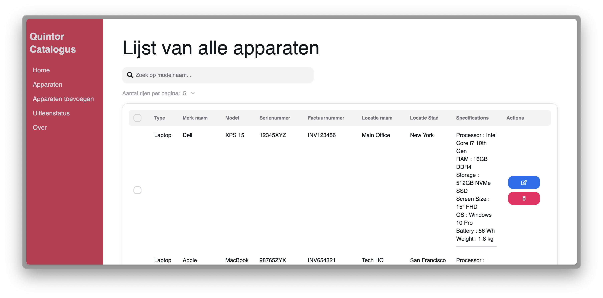
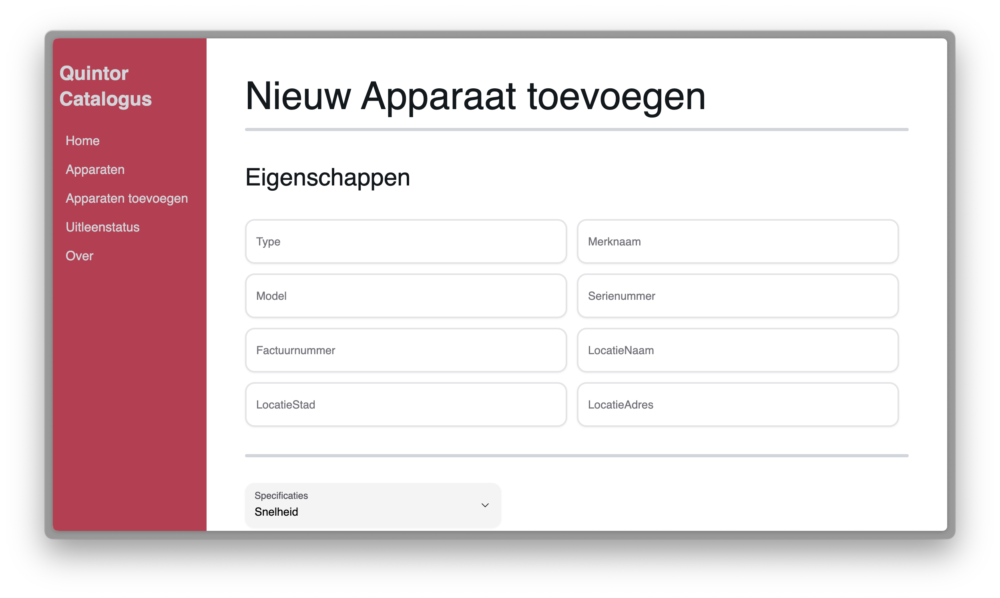
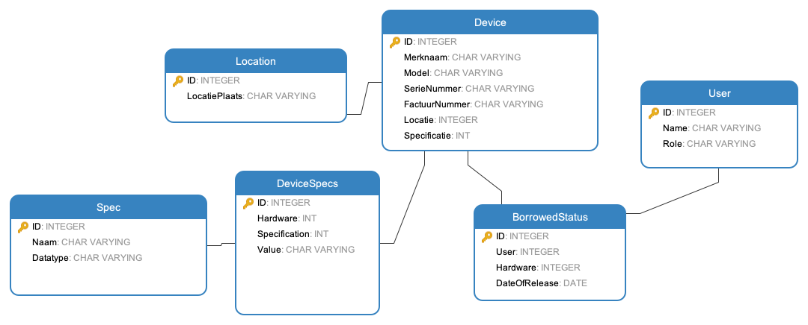

[![Contributors][contributors-shield]][contributors-url]
[![Stargazers][stars-shield]][stars-url]
[![Issues][issues-shield]][issues-url]
[![Forks][forks-shield]][forks-url]
[![LinkedIn][linkedin-shield]][linkedin-url]

# QuintorCatalogBackEnd

The Quintor Catalog is an automated hardware catalog for the software company Quintor. System administrators can add, update, delete, search, filter, sort, and borrow hardware components. 
CTO can approve/deny a borrow request to a user. The hardware is stored in a database. The front end is built using React. [Go to Front end repo](https://github.com/MarkStreek/QuintorCatalogFrontEnd)





This application was built in Spring Boot. Additionally, the application uses a MySQL database to store the hardware components. The information is served to the front end using a REST API. A REST API is a way to communicate between different software systems regardless of the operating system or programming language. 


[//]: #

[//]: # (![Screenshot4]&#40;docs/screenshots/homepage_phone.png&#41;)

[//]: # (<div align="center">)

[//]: # (  <a href="https://github.com/MarkStreek/QuintorCatalogBackEnd">)

[//]: # (    )

[//]: # (  </a>)

[//]: # (  <a href="https://github.com/MarkStreek/QuintorCatalogBackEnd">)

[//]: # (    )

[//]: # (  </a>)

[//]: # (<h1 align="center">QuintorCatalogBackEnd</h3>)

[//]: # ()
[//]: # (  <p align="center">)

[//]: # (    Automated hardware catalog for the software company Quintor)

[//]: # (    <br />)

[//]: # (    <a href="https://github.com/MarkStreek/QuintorCatalogBackEnd"><strong>Explore the docs »</strong></a>)

[//]: # (    <br />)

[//]: # (    <br />)

[//]: # (    <a href="https://github.com/MarkStreek/QuintorCatalogBackEnd">View Demo</a>)

[//]: # (    ·)

[//]: # (    <a href="https://github.com/MarkStreek/QuintorCatalogBackEnd/issues">Report Bug</a>)

[//]: # (  </p>)

[//]: # (</div>)

## Table of Contents

- [QuintorCatalogBackEnd](#quintorcatalogbackend)
  - [Table of Contents](#table-of-contents)
  - [Getting Started](#getting-started)
  - [About Quintor](#about-quintor)
  - [About the project](#about-the-project)
  - [Full Insight](#full-insight)
    - [Annotations](#annotations)
    - [Database schema](#database-schema)
    - [Entities](#entities)
    - [Repository](#repository)
    - [Model](#model)
    - [Service](#service)
    - [DTO](#dto)
    - [Configuration](#configuration)
    - [Controllers](#controllers)
    - [Exception Handler / RestControllerAdvice](#exception-handler--restcontrolleradvice)
    - [Auth / Authentication](#auth--authentication)
  - [Unit Tests](#unit-tests)
  - [Built with](#built-with)
  - [React Project](#react-project)

## Getting Started

**! It is very adviced to read the full insight of the project before starting the application !**

To start the application, clone the repo and navigate to the cloned folder. Type the following command in the terminal:

```bash
java -jar QuintorCatalogBackEnd-0.0.1-SNAPSHOT.jar
```

> Warning: before starting the application, you have to meet the following (minimum) requirements to run the application:

**Install**:
- Java 21 or higher
- Mysql 8.0

**Database Operations**:

 - Create a database account
 - Create a new database in mysql
 - Make sure the database is running
 - Make sure the database account has the correct permissions

**Application Operations**:

 - Fill in the database credentials in the application.properties file
 - Build the application using Gradle, navigate to the cloned folder and type the following command in the terminal:
 ```bash
 ./gradlew build
```

> After building the application, you can start the application using the command mentioned above.

## About Quintor

Quintor is a software company based in the Netherlands. Quintor helps customers to professionalize software development.

Quintor has the following disciplines:

1. Agile analytics
2. Software Development
3. Platform Engineering
4. Architecture
5. Cloud-native development
6. Security

Currently, Quintor Groningen is documenting all their hardware components in a simple Excel sheet. This is not efficient and not user-friendly.
Therefore, we created an automated hardware catalog for Quintor. This catalog will store all hardware components in the company.

[Checkout Quintors awesome website](https://quintor.nl/)

## About the project

This project was created by students bioinformatics at the Hanze University of Applied Sciences. The main task was to create a (automated) catalog to store all hardware components in the company. This catalog will be used by system administrators to manage the hardware components. The project was built in 1 semester.

Additionally, the catalog will be able to:

- Add new hardware components
- Update existing hardware components
- Delete hardware components
- Search for hardware components
- Filter hardware components
- Sort hardware components
- Borrow hardware components to a user
- CTO can approve/deny a borrow request to a user

## Full Insight

*This section will deep dive into the project functionalities and approaches. This is a must-read before starting the application. Additionally, this section is handy for future developers who want to expand to the project.*

> There is a `wiki page` available for this project. The wiki page contains this information in a more structured way. [Go to the wiki page](https://github.com/MarkStreek/QuintorCatalogBackEnd/wiki) 

In the project, the following packages are present:

- **Auth** : This package contains the main security configuration. The main security filter is being defined here. Every new request that is made to the rest controllers is first being checked by the security filter.
- **Config** : This package contains the configuration of the application. One of these classes is responsible for putting some test data in the database, every time the application starts up.
- **Controllers** : This package contains all the rest controllers. The REST controllers are responsible for handling the incoming requests.
- **DTO** : This package contains objects that are used to transfer data from the back end to the front end.
- **Entities** : This package contains all the entities. The entities are the objects that are stored in the database.
- **Model** : This package contains the models. The models are used to define the objects that are used in the application.
- **Repository** : This package contains the repositories. The repositories are used to communicate with the database.
- **Services** : This package contains the services. The services are used to handle the main logic and checking of the application.

Now you have a basic understanding of the project structure, we can start with describing the project. We will start at the basics of the project and walk our way up through the more complex parts of the project. During development of this project, we walked through the same path: getting familiar with spring, creating a database design, creating the entities, creating the repositories, etc.

### Annotations

First, we will kick off with the annotations. In the project there is wide variety of annotations used. Annotations are used to add metadata to the classes and methods. Also define the behavior of the certain classes or methods in classes. It's good to know some main annotations that are used in the project. The next list contains some of the main annotations that are used in the project.

- `@Autowired`: used to inject the object dependency implicitly.
- `@Configuration`: used to define the configuration classes.
- `@Bean`: used to define the beans in the configuration classes. Beans are objects that are managed by the Spring IoC container.
- `@Component`: used to define the beans in the configuration classes.
- `@Service`: used to define the services in the services package.
- `@Entity`: used to define the database entities
- `@Repository`: used to define the repositories that communicate with the entities

This is only a small list of the used annotations. Sometimes they are hard to understand. Sometimes they speak for themselves. For example, we use a package called `lombok`. Lombok is a library that creates simple boiler plate code with annotations. Let's look at the class below:

```java
// Location.java

@Getter
@Setter
@Entity
@Table(name = "locations")
public class Location {

    @Id
    @GeneratedValue(strategy = GenerationType.IDENTITY)
    private Long id;

    @Column(name = "name")
    private String name;

    @Column(name = "city")
    private String city;

// ...

}
```

The `@Getter` and `@Setter` annotations are used to create the getters and setters for the class. This makes the class more readable and easier to understand. Want to find out more about Lombok? [Read more about Lombok](https://projectlombok.org/)

### Database schema

Right before starting the 'real' development of the project, it's necessary to create a database design. Below you can find the database schema. The fields of the tables are in Dutch, but if you closely look at the table names and structure, you can understand the schema. 



Just like you will expect, `Devices` contains all the devices. The `Locations` table contains all the locations. The `BorrowedStatus` table contains all the borrowed statuses. The `Users` table contains all the users. The `DeviceSpecs` table contains all the device specifications. 

The DeviceSpecs and Spec table need a closer look. The `DeviceSpecs` contains a `Device` id and a `Spec` id. The Spec id is placed in a different table. This is because it's now future and expanding proof. A user can add a new spec in the spec table and give it a value in the DeviceSpecs table. They are completely separate from each-other. In other words, you don't have to use empty fields in the DeviveSpecs if you have devices without that spec. You simply tell which spec you have and give it a value. You can reuse them as well. 

There is end-point in the application that is used to serve all the current specs in the database to the front end. The `getAllSpecs` method in the `SpecController.java` class makes sure of that.

```java
// SpecController.java

@GetMapping
public Map<String, String> getAllSpecs() {
    return specsService.getAllSpecs();
}
```

### Entities

Right after creating knowing the database design, entities implementations can be read more easily.

The entities are the objects that are stored in the database. The entities are the objects that are being converted to `DTO` objects. The entities are actually just database schemes. 

In this project, JPA is used to define the entities. JPA stands for Java Persistence API. JPA is a Java specification for managing relational data in Java applications. It's a simple way to create MySQL databases without writing SQL queries or creating tables. Because of JPA, the entities are automatically converted to tables in the database. 

The entities in classes are annotated with `@Entity`, `@Table`, `@Id`, `@GeneratedValue`, etc. These annotations are used to define the database scheme. Only the `Role.java` class is not an entity. The `Role.java` class is used to define the roles in the application. The roles are used to define the permissions in the application.

There are a number of annotations that may not be self-explanatory. These are `@ManyToOne`, `@OneToMany`, `@OneToOne`, `@ManyToMany`. These annotations are used to define the relationship between the entities. For example, the `Device.java` class contains a `@ManyToOne` annotation. 

```java
// Device.java

@Table(name = "devices")
public class Device {

    // ...

    @ManyToOne
    @JoinColumn(name = "location_id")
    private Location location;

    // ...

}
```

This annotation is used to define the relationship between the `Device` and `Location` entity. The `Device` entity can only have one `Location` entity. The `Location` entity can have multiple `Device` entities. This is a many-to-one relationship. The `@ManyToOne` annotation is used to define the many-to-one relationship. The `@OneToMany` annotation is used to define the one-to-many relationship. The `@OneToOne` annotation is used to define the one-to-one relationship. The `@ManyToMany` annotation is used to define the many-to-many relationship.

The `User.java` class implements the `UserDetails` interface. This UserDetails interface is used to provide core user information to the spring security framework. Because of this implementations, some methods needs to be overriden for the user. There are 4 methods that start with `is`...(AccountNonExpired/AccountNonLocked/CredentialsNonExpired/Enabled). These methods are all returning true. This is because the application doesn't have any restrictions on the user. The `getAuthorities` method is used to get the authorities of the user. 

```java
// User.java

@Override
public Collection<? extends GrantedAuthority> getAuthorities() {
    return List.of(new SimpleGrantedAuthority(role.name()));
}
```

This method is used to return a collection of GrantedAuthority objects, which represent the authorities granted to the user. SimpleGrantedAuthority is created using the name of the user's role. SimpleGrantedAuthority is a concrete implementation of GrantedAuthority that takes a string representation of an authority granted to the user. More about the security if provided later in this documentation.

### Repository

The repositories are the main classes that are used to communicate with the database. The repositories are used to get, save, update and delete the entities. As mentioned above, JPA is used in this project. Thats the reason why all the repositories are implementing the `JpaRepository` interface.

```java
@Repository
public interface DeviceSpecsRepository extends JpaRepository<DeviceSpecs, Long> {

    /**
     * Method that retrieves all the DeviceSpecs from the database that belong to a certain device.
     *
     * @param device The device to which the specs belong
     * @return A list of all the DeviceSpecs that belong to the given device
     */
    List<DeviceSpecs> findByDevice(Device device);
}
```

As you can see, this class is very small. All the operations like save, update, delete, etc. are already implemented in the `JpaRepository` interface. You don't have to write these methods yourself. Additionally, you can easily add your own methods to the repository. The `findByDevice` method is a custom method that is used to get all the specs that belong to a certain device. This method is, for example, used in the `MainDeviceService.java` class. 

```java
// MainDeviceService.java

List<DeviceSpecs> deviceSpecs = this.deviceSpecsRepository.findByDevice(device);
```

Learn more about `JPA` [here](https://en.wikipedia.org/wiki/Java_Persistence_API).

### Model

The model package in the project is a very basic package which contains only two classes. These classes are only used for two tasks: (1) as a JSON incoming request or (2) as a JSON outgoing response.

```java
// LoginRequest.java

@Getter
@Setter
public class LoginRequest {

    private String email;
    private String password;

    public LoginRequest(String email, String password) {
        this.email = email;
        this.password = password;
    }
}
```

When the front end (client) is sending a login request with in the body the email and password as JSON, the `LoginRequest` object is used to map the incoming JSON to an object. This is done automatically by Spring. The `@RequestBody` annotation is used in the controller to map the incoming JSON. This is described in more detail, with examples, in the controllers section.

### Service

The Service classes are the main classes in the project. The logic and checking of all parameters are done in the service classes. I.e., checking if a device already exists in the database, re-using an already used location, etc.

Let's take a closer look at the service classes. The `MainDeviceService.java` class is the most important class in the service package. This class contains all methods that deal with the devices.

### DTO

When listing devices in the frond end, you need devices, locations, device specification, etc. It is very redundant to first request the devices, then the locations, etc. Here comes the DTO package in play. DTO stands for Data Transfer Object. The DTO package contains objects that are used to transfer data from the back end to the front end. The `DeviceDTO.java` class is the most important class in the DTO package. This class contains all the information that is needed to display a device in the front end. Additionally, The `DeviceDTO.java` is also used as incoming request. Just like we were talking above: `@RequestBody @Valid DeviceDTO deviceDTO`.

Right before sending the data to the front end, the right database lines are called from the database and converted to DTO. This is done in the `Converter` classes. The `Converter.java` class contains a method that: creates a new DTO object, sets the right values with incoming database lines (devices, locations, specifications, etc.) and returns the DTO object. Below is an example of a converter method in `BorrowDTOConverter.java` class:

```java
// BorrowDTOConverter.java

@Override
public BorrowDTO apply(BorrowedStatus borrowedStatus) {
    BorrowDTO borrowDTO = new BorrowDTO();
    borrowDTO.setId(borrowedStatus.getId());
    // Create a new User and Device object
    User user = createUser(borrowedStatus);
    Device device = createDevice(borrowedStatus);
    Location location = createLocation(borrowedStatus);

    // Set the User and Device object to the BorrowDTO object
    borrowDTO.setUser(user);
    borrowDTO.setDevice(device);
    device.setLocation(location);

    log.info("Converted borrowed status: {}", borrowDTO);
    return borrowDTO;
}
```

The method creates a new BorrowDTO object, the values are set with the provided data from the database (borrowedStatus) and that's basically it. After converting, the DTO object is sent to the front end using the controller.

Because the DTO is sometimes also used as incoming request, the `@Valid` annotation is used. The `@Valid` annotation is used to validate the incoming request. These annotation is placed in the controller and checks for more validation annotations in the incoming request-object. For example, the `@NotNull` annotation is used in the `DeviceDTO.java` class. This annotation checks if the incoming request contains a value for the field. An example validation in the `DeviceDTO.java` class:

```java
@NotNull
@NotEmpty
@Length(min = 1, max = 50, message = "Merk moet tussen de 1 en 50 karakters lang zijn")
private String brandName;
```

Message is passed to the exception handler when the validation fails.

### Configuration

The configuration package contains two classes. One of these classes is responsible for putting some test data in the database, every time the application starts up. This class probably should be empty/or deleted, when starting the application in production. The `WebConfig.java` class contains a single method that makes sure the request from localhost:3000 are not failing because of the CORS policy. 

```java
// WebConfig.java

public void addCorsMappings(CorsRegistry registry) {
    registry.addMapping("/**")
            .allowedOrigins("http://localhost:3000")
            .allowedMethods("GET", "POST", "PUT", "DELETE");
}
```

Because the front end is running on localhost:3000, the request from the front end to the back end should be allowed. Normally this is not allowed, because you're making a request to your own server. This method allows the GET, POST, PUT and DELETE methods from the front end to the back end. Read more about CORS [here](https://en.wikipedia.org/wiki/Cross-origin_resource_sharing).

### Controllers

The controllers package contains all the rest controllers. The REST controllers are responsible for handling the incoming requests. The REST controllers are the entry point of the application. The end-points are defined above methods (with `@Mapping`) of the REST controller. When a request is incoming, the method that is defined below the `@Mapping` is being called. Good to know, some end-point methods take arguments. For example take the `AuthController.java` class and look at the login method:

```java
@PostMapping("/login")
public LoginResponse login(@RequestBody LoginRequest request) {
    return authenticationService.signin(request);
}
```

This method takes a LoginRequest as input. LoginRequest is simple object that is defined in the `model` package:

```java
// LoginRequest.java

@Getter
@Setter
public class LoginRequest {

    private String email;
    private String password;

    public LoginRequest(String email, String password) {
        this.email = email;
        this.password = password;
    }
}
```

When creating a request to the /auth/login end-point, the request should contain a body with an email and password. The body should be in JSON format. Spring will **automatically** cast/map this incoming JSON request to the LoginRequest object. The incoming request body:

```json
{
    "email": "some_user@info.com",
    "password": "welcome123"
}
```

Will be cast to a LoginRequest object. This is very handy, because you don't have to do this manually. This way of incoming request-to-object mapping is used more often in the project. Later, in the `DTO`, we will see that this method is extremely useful for `@Validation`.

If a method does't contain an `@Mapping` at the top, the url defined above the Controller class is enough to trigger the method. Let's take a quick look at an exmple method in the `DeviceController.java` class:

```java
@RestController
@RequestMapping("/devices")
public class DeviceController {
  
  @PostMapping
  public ReturnMessage addDevice(@RequestBody @Valid DeviceDTO deviceDTO, HttpServletRequest request) {
      Logging.logIncomingRequest(request);
      mainDeviceService.addDevice(
              deviceDTO.getType(),
              deviceDTO.getBrandName(),
              deviceDTO.getModel(),
              deviceDTO.getSerialNumber(),
              deviceDTO.getInvoiceNumber(),
              deviceDTO.getLocationCity(),
              deviceDTO.getLocationAddress(),
              deviceDTO.getLocationName(),
              deviceDTO.getSpecs()
      );
      return new ReturnMessage(
              HttpStatus.OK.value(),
              new Date(),
              "Apparaat toegevoegd aan de database",
              "Een nieuw apparaat is toegevoegd aan de Device tabel in de database"
      );
  }
}
```

A post request to the end-point `/devices` will trigger the `addDevice` method. Of course, the request must be authorized.

### Exception Handler / RestControllerAdvice

Fill in...

### Auth / Authentication

To start with the Auth package. This package contains the main security configuration. The main security filter is being defined here (`JwtAuthenticationFilter.java`). Every new request that is made to the rest controllers is first being checked by the `doFilterInternal` method of the class. The security filter checks if the request is allowed to be made. I.e., is the right token present in the request header? Or is the token still valid? Let's look at the main logic ot the `doFilterInternal.java` method:

```java
// JwtAuthenticationFilter.java

@Override
protected void doFilterInternal(
        HttpServletRequest request, 
        @NonNull HttpServletResponse response, 
        @NonNull FilterChain filterChain) throws ServletException, IOException {
    
    final String authHeader = request.getHeader("Authorization");
    // Check for the bearer presence, if it is not present, continue with the filter chain
    if (checkForBearerPresence(request, response, filterChain, authHeader)) return;
    
    final String jwt = authHeader.substring(7);
    final String userEmail = jwtService.extractUsername(jwt);
    
    if (userEmail != null && !userEmail.isEmpty() && SecurityContextHolder.getContext().getAuthentication() == null) {
        UserDetails userDetails = userService.userDetailsService().loadUserByUsername(userEmail);
        if (jwtService.isTokenValid(jwt, userDetails)) {
            SecurityContext context = SecurityContextHolder.createEmptyContext();
            UsernamePasswordAuthenticationToken authToken = new UsernamePasswordAuthenticationToken(
                    userDetails, null, userDetails.getAuthorities());
            authToken.setDetails(new WebAuthenticationDetailsSource().buildDetails(request));
            context.setAuthentication(authToken);
            SecurityContextHolder.setContext(context);
        }
    }
    filterChain.doFilter(request, response);
}
```

First impression of the method: very big and hard to understand. Let's break it down. The method first gets the header out of the request. With that header, another method is being called that checks if the bearer token is present. If not, the method will return and the request will be denied. 

After the checking the bearer presence, the method extracts the token from the header. The token is then used to extract the username from the token. The username is then used to get the user details from the database. The user details are then used to check if the token is still valid.

An additional check is being made to see if the user is not empty or User details are empty. After those checks are good, the UsernamePasswordAuthenticationToken is being created. This token is then used to set the security context.

If the token is not valid, the request will be denied/caught by the exception handler. More on the exception handler later. 

Additionally, the Auth package contains the security configuration in which the end points are being configured. /auth/login, for example is accessible for everyone, this is defined in the security configuration (`SecurityConfig.java`). `PasswordConfig.java` class contains the password encoder. The passwords in the database are encoded using the BCryptPasswordEncoder. The method in the `PasswordConfig.java` class is used to decode the password when a user is trying to login. [Read more about BCrypt Encoding](https://en.wikipedia.org/wiki/Bcrypt). 

The password encryption method could be changed to a different, probably better alternative. Make sure, to also change the encoding method for storing the password. I.e., if you change the decoder also change the encoder (but this makes sense, right?).

## Unit Tests

After every push to the main branch, the unit tests will be run automatically. The tests are run using GitHub Actions and executed on an ubuntu-latest runner. Results are shown in the badge below:

>[](https://github.com/MarkStreek/QuintorCatalogBackEnd/actions/workflows/runTests.yml)

## Built with


## React Project

The front end of this project can be found [here](https://github.com/MarkStreek/QuintorCatalogFrontEnd)


<!-- Markdown Links -->
[contributors-shield]: https://img.shields.io/github/contributors/MarkStreek/QuintorCatalogBackEnd.svg?style=for-the-badge
[contributors-url]: https://github.com/MarkStreek/QuintorCatalogBackEnd/graphs/contributors
[stars-shield]: https://img.shields.io/github/stars/MarkStreek/QuintorCatalogBackEnd.svg?style=for-the-badge
[stars-url]: https://github.com/MarkStreek/QuintorCatalogBackEnd/stargazers
[issues-shield]: https://img.shields.io/github/issues/MarkStreek/QuintorCatalogBackEnd.svg?style=for-the-badge
[issues-url]: https://github.com/MarkStreek/QuintorCatalogBackEnd/issues
[linkedin-shield]: https://img.shields.io/badge/-LinkedIn-black.svg?style=for-the-badge&logo=linkedin&colorB=555
[linkedin-url]: https://www.linkedin.com/company/quintor/
[forks-shield]: https://img.shields.io/github/forks/MarkStreek/QuintorCatalogBackEnd.svg?style=for-the-badge
[forks-url]: https://github.com/MarkStreek/QuintorCatalogBackEnd/network/members
