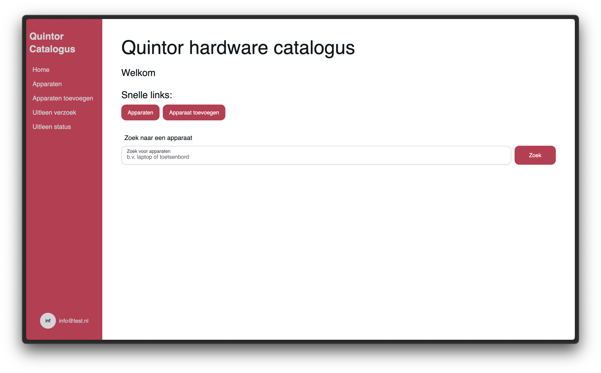
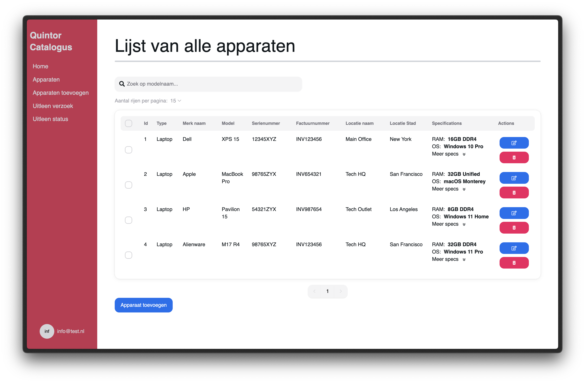
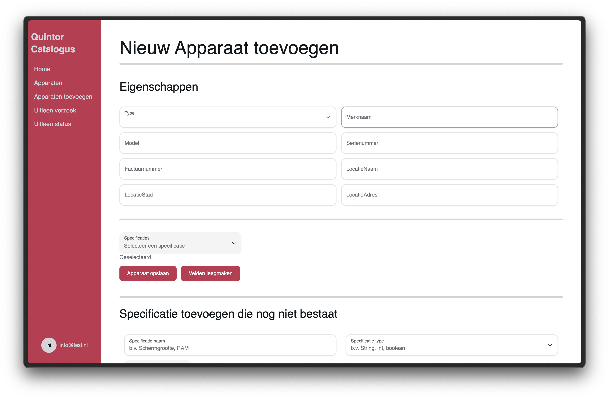
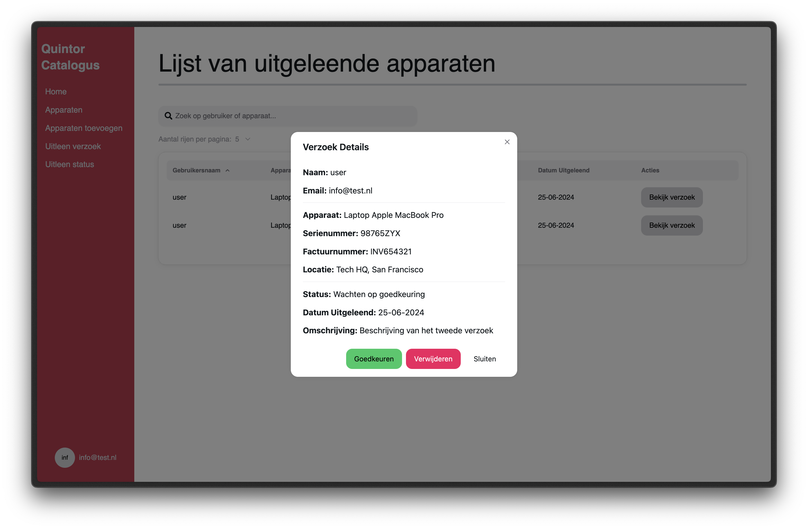

# Software Design document

> Project: **Quintor Hardware Catalogus**

Namen: Sibren Reekers en Mark van de Streek
Bedrijf: Quintor B.V. Groningen
Datum: 06 maart 2024

## Table of contents

- [Software Design document](#software-design-document)
  - [Table of contents](#table-of-contents)
  - [Management Summary](#management-summary)
  - [Background and context](#background-and-context)
  - [Requirements specifications](#requirements-specifications)
    - [Top-level features](#top-level-features)
    - [User stories](#user-stories)
    - [Use cases](#use-cases)
    - [Technical requirements and maintenance](#technical-requirements-and-maintenance)
      - [Maintenance](#maintenance)
  - [Current status of development](#current-status-of-development)
  - [Discussion](#discussion)
  - [Code Repo](#code-repo)

## Management Summary

De Quintor catalogus geeft een overzicht van alle aanwezige apparaten binnen Quintor. Ook zijn de huidige locatie, gebruiker en specificaties van apparaten te zien in de applicatie. Op deze manier kan er dus snel gekeken worden welke gebruiker een specifiek apparaat in gebruik heeft. Verder heeft de applicatie een functie waarmee de technisch directeur (CTO) van Quintor goedkeuring kan geven bij een dubbele uitleen. Als een medewerker een tweede apparaat in gebruik wil nemen, moet daar goedkeuring voor gegeven worden.

Om een globale schatting te geven van de kosten van de applicatie, zal er een simpele rekensom worden gemaakt. De kosten van de applicatie zullen bestaan uit de uren die de ontwikkelaars aan de applicatie werken. De kosten van een junior softwareontwikkelaar zijn ongeveer € 50,- per uur.

Het project zal ongeveer 18 weken in beslag nemen. Beiden zullen we ongeveer 25-30 uur per week aan het project werken. Dit betekent dat er in totaal ongeveer 900-1080 uur aan het project zal worden gewerkt. Dit betekent dat de kosten van de applicatie ongeveer € 45.000,- tot € 54.000,- zullen zijn.

De applicatie zal verschillende features bevatten. Deze features zullen over een tijdlijn ontwikkeld worden. Er zal gekeken worden naar de use cases.

De milestones van de applicatie zijn:

1. Een eenvoudige pagina waarop alle hardware componenten getoond worden.
2. Halverwege het proces, een pagina waarop hardware componenten toegevoegd, verwijderd, aangepast en gefilterd kan worden.
3. Een authenticatielaag die de gebruiker toegang geeft tot de verschillende pagina's.
4. Een uitleen verzoek kunnen aanmaken voor een CTO goedkeuring.

De deadline van de applicatie staat voor nu gepland in week 24 van 2024.

Aan de hand van deze applicatie is het voor een systeembeheerder makkelijker om de apparaten te beheren en lokaliseren. Daarnaast is het voor de technisch directeur makkelijker om verzoeken tot uitleen goed te keuren.

## Background and context

Quintor is een software bedrijf met meerdere vestigingen in Nederland. Quintor helpt veel klanten en heeft een brede sector. Hun focus ligt bij de volgende aspecten:

1. Agile analyse
2. Software development
3. Platform engineering
4. Architectuur
5. Cloud-native development
6. Security

Verder helpt Quintor een groot aantal studenten bij hun stages en/of afstudeerprojecten. Ook heeft Quintor een grote leeromgeving, genaamd Quintor Academy. Er worden veel leer sessies aangeboden in verschillende onderwerpen van de benoemde aspecten.

Bij Quintor in Groningen wordt op dit moment handmatig hardware op een wikipagina bijgehouden. Denk hierbij aan monitoren of laptops die worden uitgeleend aan medewerkers. Uiteraard is dit niet wenselijk. Om te beginnen kost dit de systeembeheerder veel tijd en tevens is het ook erg foutgevoelig. Het is daarom voor hen zeer relevant om een software product te hebben waarmee ze dit gemakkelijk kunnen bijhouden.

De applicatie die ontwikkeld zal worden, gaat door Quintor breed gebruikt worden om hardware bij te houden. Verder zal deze applicatie ook worden gebruikt om aan te geven wie een apparaat in gebruikt heeft bij uitleen, of waar het ligt opgeslagen als het niet is uitgeleend. Tot slot zal de applicatie gebruikt worden om verzoeken goed te keuren bij een dubbele uitleen.

## Requirements specifications

### Top-level features

Zoals beschreven zal het bijhouden van apparaten, de hoofdfunctionaliteit van de applicatie zijn. Verder zijn er natuurlijk meer specificaties waaraan de applicatie zal moeten voldoen:

1. Een login en registratie systeem.
2. Een user management database met de rollen admin en gast.
3. Een database waarin hardwareproducten kunnen worden opgeslagen. De volgende velden moeten verplicht worden ingevuld: merk, model, serienummer, factuurnummer, werknemer bij uitlening, datum van afgifte, gebruiksstatus.
4. Een pagina waarin alle hardware componenten getoond worden en waar (minimaal) gefilterd kan worden op de volgende velden:
    - users
    - actief
    - type item
    - merk
    - model
    - serienummer
5. Een apparaat kunnen toevoegen aan de database.
6. Een apparaat kunnen toekennen aan een gebruiker
7. Een verzoek kunnen aanmaken voor een CTO goedkeuring.

### User stories

1. Als systeembeheerder wil ik kunnen zien welke apparaten wij bij Quintor allemaal in beheer hebben, zodat overzichtelijk wordt wat we hebben en wat eventueel uitgeleend zou kunnen worden.

2. Als systeembeheerder wil ik apparaten aan de catalogus toe kunnen voegen, zodat wanneer we nieuwe hardware binnen krijgen dit gelijk bij de huidige hardware kunnen zetten.

3. Als systeembeheerder wil ik een hardware product kunnen uitlenen aan een werknemer via de catalogus, zodat de gebruiksstatus van het hardware product automatisch wordt geüpdate en aan de desbetreffende werknemer wordt toegevoegd.

4. Als systeembeheerder wil ik kunnen zien wat de gebruiksstatus in van alle apparaten in de catalogus, zodat overzichtelijk wordt welke apparaten kunnen worden uitgeleend en wie wat in bezit heeft.

5. Als systeembeheerder wil ik kunnen zoeken binnen de catalogus op verschillende specs, zodat wanneer een werknemer een speciaal verzoek heeft ik makkelijk kan checken of zo’n apparaat beschikbaar is.

6. Als systeembeheerder wil ik kunnen zien hoeveel hardware we van een bepaalde spec hebben, zodat er bij gebrek een verzoek kan worden ingediend om nieuwe hardware te kopen.

7. Als systeembeheerder wil ik kunnen zien wanneer een uitgeleend product weer terug is en door wie, zodat ik weet wanneer een hardware product weer opnieuw uitgeleend kan worden.

8. Als systeembeheerder wil ik een uitleenverzoek kunnen doen aan de CTO wanneer een werknemer een tweede hardware product wil uitlenen, zodat dat goed of afgekeurd kan worden.

9. Als Chief technical officer (CTO) wil ik een melding krijgen wanneer de systeembeheerder iets uit wil lenen, zodat ik daar goedkeuring voor kan geven.

### Use cases

| ID                    | UC-2                                                                                                                                                                                                                                                                                                                                                                                                                                                           |
|-----------------------|----------------------------------------------------------------------------------------------------------------------------------------------------------------------------------------------------------------------------------------------------------------------------------------------------------------------------------------------------------------------------------------------------------------------------------------------------------------|
| Title                 | Toevoegen van hardware product aan de catalogus                                                                                                                                                                                                                                                                                                                                                                                                                |
| Description           | De systeembeheerder kan via deze pagina een nieuw hardware product aan de catalogus toevoegen.                                                                                                                                                                                                                                                                                                                                                                 |
| Primary Actor         | Systeembeheerder                                                                                                                                                                                                                                                                                                                                                                                                                                               |
| Preconditions         | Systeembeheerder is in gelogd via het authenticatie systeem                                                                                                                                                                                                                                                                                                                                                                                                    |
| Postconditions        | Systeembeheerder kan het net toegevoegde hardware product in de hardware catalogus zien staan.                                                                                                                                                                                                                                                                                                                                                                 |
| Main Success Scenario | 1. Systeembeheerder klikt op de knop om een apparaat toe te voegen.   2. Systeem laat een formulier zien waar het type hardware product geselecteerd kan worden en waar de verschillende specs kunnen worden ingevuld.   3. Systeembeheerder selecteert het apparaat en vult de specs van het apparaat in.   4. Systeembeheerder klikt op de add knop.   5. Systeem registreert het nieuwe apparaat en laat een succesvol toegevoegd bericht zien. |
| Extensions            | 4a. Niet alle verplichte velden zijn ingevuld bij het formulier.    - 4a1. Systeem laat een error bericht zien dat niet alle verplichte velden zijn ingevuld.   - 4a2. Systeembeheerder sluit het formulier af en verlaat de use case of vult de verplichte velden goed in.                                                                                                                                                                              |
| Frequency of Use      | Een aantal keer per half jaar                                                                                                                                                                                                                                                                                                                                                                                                                                  |
| Status                | Nog niet geïmplementeerd                                                                                                                                                                                                                                                                                                                                                                                                                                       |
| Owner                 | Nader te bepalen                                                                                                                                                                                                                                                                                                                                                                                                                                               |
| Priority              | P2 - Medium +                                                                                                                                                                                                                                                                                                                                                                                                                                                  |

| ID                    | UC-3                                                                                                                                                                                                                                                                                                                                                                                                                                                                                                                                                                                                                                                                                                                                                                                                                                                                                                                 |
|-----------------------|----------------------------------------------------------------------------------------------------------------------------------------------------------------------------------------------------------------------------------------------------------------------------------------------------------------------------------------------------------------------------------------------------------------------------------------------------------------------------------------------------------------------------------------------------------------------------------------------------------------------------------------------------------------------------------------------------------------------------------------------------------------------------------------------------------------------------------------------------------------------------------------------------------------------|
| Title                 | Hardware product uitlenen                                                                                                                                                                                                                                                                                                                                                                                                                                                                                                                                                                                                                                                                                                                                                                                                                                                                                            |
| Description           | Een hardware product uit de catalogus aan een werknemer uit kunnen lenen. Gebruiksstatus van het apparaat wordt automatisch geüpdate en apparaat wordt gelinkt aan de werknemer.                                                                                                                                                                                                                                                                                                                                                                                                                                                                                                                                                                                                                                                                                                                                     |
| Primary Actor         | Systeembeheerder                                                                                                                                                                                                                                                                                                                                                                                                                                                                                                                                                                                                                                                                                                                                                                                                                                                                                                     |
| Preconditions         | Systeembeheerder is ingelogd via het authenticatie systeem                                                                                                                                                                                                                                                                                                                                                                                                                                                                                                                                                                                                                                                                                                                                                                                                                                                           |
| Postconditions        | Systeembeheerder ziet dat de gebruiksstatus van het apparaat is geüpdate, en ziet het apparaat bij de desbetreffende werknemer staan.                                                                                                                                                                                                                                                                                                                                                                                                                                                                                                                                                                                                                                                                                                                                                                                |
| Main Success Scenario | 1. Systeembeheerder selecteert “Leen apparaat uit” van de catalogus pagina.   2. Het systeem laat een formulier zien waar de systeembeheerder het apparaat en de werknemer kan aangeven.   3. Systeembeheerder klikt op de submit knop.   4. Systeem geeft een succes melding dat het apparaat succesvol is uitgeleend aan de werknemer.                                                                                                                                                                                                                                                                                                                                                                                                                                                                                                                                                                    |
| Extensions            | 1a. De systeembeheerder kan ook naar het apparaat navigeren in de catalogus om een werknemer eraan te koppelen.   - 1a1. Door op drie puntjes bij het apparaat naar wens te klikken wordt door het systeem een klein dropdown menuutje geopend waar een optie tot uitlening aan werknemer staat.   - 1a2. Systeembeheerder klikt op die optie tot uitlening aan werknemer knop, vanaf daar wordt het main succes scenario gevolgd vanaf stap 2.     2a. De desbetreffende werknemer heeft al een apparaat in bezit.   - 2a1. Systeem geeft een bericht dat de werknemer al een apparaat in bezit heeft. In dit bericht is de optie om af te sluiten of een verzoek te doen voor een tweede uitlening.   - 2a2. Systeembeheerder klikt op af sluiten om weer terug te gaan naar het formulier of doet een verzoek tot tweede uitlening. Het verzoek tot tweede uitlening opent een nieuwe use case. |
| Frequency of Use      | Een aantal keer per maand                                                                                                                                                                                                                                                                                                                                                                                                                                                                                                                                                                                                                                                                                                                                                                                                                                                                                            |
| Status                | Nog niet geïmplementeerd                                                                                                                                                                                                                                                                                                                                                                                                                                                                                                                                                                                                                                                                                                                                                                                                                                                                                             |
| Owner                 | Nader te bepalen                                                                                                                                                                                                                                                                                                                                                                                                                                                                                                                                                                                                                                                                                                                                                                                                                                                                                                     |
| Priority              | P1 - High                                                                                                                                                                                                                                                                                                                                                                                                                                                                                                                                                                                                                                                                                                                                                                                                                                                                                                            |

### Technical requirements and maintenance

Voor de applicatie zal gebruik worden gemaakt van de volgende technieken:

- REACT.js - minimaal versie 18.2
- Node.js - minimaal versie 20.11.0
- MySQL - minimaal versie 8.3.0
- Spring Boot - versie 3.2.3
- Java - minimaal versie 21
- CSS Tailwind - versie 3.4.1
- HTML5
- CSS3

Om het project te kunnen hosten, zullen de volgende eisen moeten worden voldaan:

1. De applicatie moet gehost worden op een server die 24/7 online is.
2. De server moet een database kunnen hosten. Deze database moet een MySQL database zijn (versie 8.3.0).
3. De server moet Java draaiend hebben (minimaal versie 21)
4. De server moet Node.js draaiend hebben (minimaal versie 20.11.0)
5. De server moet een webserver hebben die de frontend kan hosten.
6. De server moet een webserver hebben die de backend kan hosten.
7. De server moet een SSL certificaat hebben.
8. De server moet een domeinnaam hebben.

#### Maintenance

Documentatie is het belangrijkste woord als je spreekt over onderhoud van de applicatie. Het is belangrijk dat de code goed gedocumenteerd is, zodat andere ontwikkelaars ook kunnen begrijpen wat er gebeurt in de code.
Uiteraard hoort de code zelfverklarend te zijn, maar sommige principes zijn niet altijd even duidelijk. Zeker niet bij een ontwikkelaar die weinig ervaring heeft met de technieken die gebruikt zijn in de applicatie.

Elk bestand, zowel backend als frontend, bevat commentaar. Dit commentaar is in het Engels geschreven en bevat een korte uitleg over wat er gebeurt in de methode/functie. Verder is er in de readme van de repositories meer uitleg te vinden over de applicatie.

In de readme staan meer algemene zaken over de applicatie. Bijvoorbeeld, hoe de applicatie veranderd kan worden aangepast naar eigen voorkeuren. Ook staat er in de readme hoe de applicatie gestart kan worden.

Tot slot is er een (behoorlijk) uitgebreide handleiding geschreven voor ontwikkeling en uitbreiding van de applicatie. Deze handleiding is te vinden in de readme's van de repositories. Tevens zijn deze handleidingen ook geplaatst in de wiki van de repositories. 

De wiki's zijn gestructureerd opgebouwd en daarom makkelijker te lezen dan de readme's. De wiki's zijn te vinden op de volgende links:

- [BackEnd wiki](https://github.com/MarkStreek/QuintorCatalogBackEnd/wiki)
- [FrontEnd wiki](https://github.com/MarkStreek/QuintorCatalogFrontEnd/wiki)

## Current status of development

De huidige status van de ontwikkeling is dat de applicatie is afgerond. De applicatie is volledig werkend en kan gebruikt worden door de systeembeheerder van Quintor. De applicatie is klaar om in productie te worden genomen.

De volgende functionaliteiten zijn geïmplementeerd:

1. Een login systeem met JSON Web Tokens.
2. Een user management database met de rollen systeembeheerder en CTO.
3. Een thuis pagina met snelle navigatie en een directe zoekbalk naar apparaten.
4. Apparaten kunnen worden toegevoegd aan de database, inclusief specificaties en locatie.
5. Apparaten kunnen worden aangepast en verwijderd.
6. Apparaten kunnen worden weergegeven in een overzichtelijke tabel.
   1. De tabel kan gesorteerd worden op verschillende velden.
   2. De tabel is doorzoekbaar van links naar rechts.
7. Een uitleenverzoek kan gemaakt worden voor werknemer en apparaat.
8. Het eerste uitleenverzoek van een werknemer wordt automatisch goedgekeurd.
9. Een tweede uitleenverzoek moet worden goedgekeurd door de CTO.
10. Een uitleenverzoek kan verwijderd worden.

Onderstaand een aantal screenshots van de applicatie:

## Discussion

Om te reflecteren op het project, kunnen we zeggen dat het een uitermate leerzaam project is geweest. We hebben veel nieuwe technieken geleerd en toegepast. Kort kijkend naar de functionaliteiten die zijn uitgewerkt, kunnen we opmerken dat we een enkel punt niet hebben kunnen uitwerken. Namelijk het ontvangen van een melding wanneer een systeembeheerder een uitleenverzoek doet. Dit was nog een mooie aanvulling geweest op de applicatie, maar helaas hebben we hier niet genoeg tijd voor gehad.

Verder nog een inhoudelijke opmerking over het frontend gedeelte van de applicatie. Voor de JSON Web Tokens wordt er in de back end (uiteraard) gecheckt of de token geldig is. Het was mooi geweest als we deze rol ook hadden geïmplementeerd in de frontend. Specifieker voorbeeld: de knop op een verzoek goed te keuren is nu altijd zichtbaar. Het zou mooi zijn als deze knop alleen zichtbaar is voor de CTO. Verder is het dan nog mogelijk om deze role based access control uit te breiden, zodat bepaalde kenmerken van apparaten niet zichtbaar zijn voor de systeembeheerder.

Tot slot nog een opmerking over de code. De backend is geschreven in Java en de frontend in REACT.js. Zoals eerder al opgemerkt, waren beide technieken ons niet bekend. Het was daarom een uitdaging om de code te schrijven. Echter hadden we allebei wel meer ervaring in Java dan in REACT.js. Dit is ook terug te zien in de code. De backend zal van iets hogere kwaliteit zijn dan de frontend. Functioneel doet de frontend niet te kort.

## Code Repo

Voor dit project zijn twee repositories. De frontend en backend zijn compleet verschillend van elkaar en daarom is er gekozen om deze in twee verschillende repositories te plaatsen.

- [BackEnd repository](https://github.com/MarkStreek/QuintorCatalogBackEnd)
- [FrontEnd repository](https://github.com/MarkStreek/QuintorCatalogFrontEnd)

[Terug naar het begin ↑](#top)
